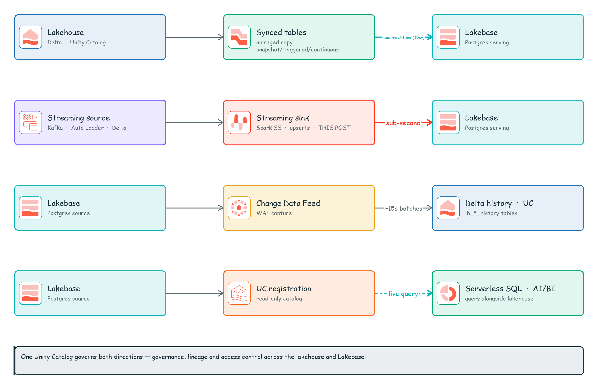
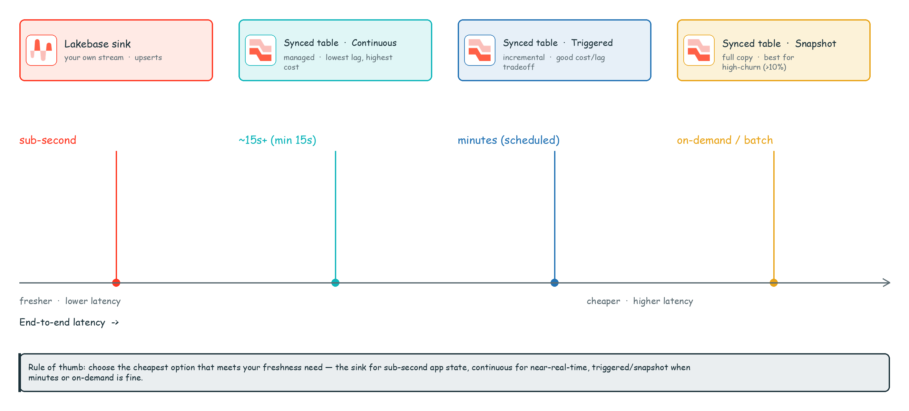
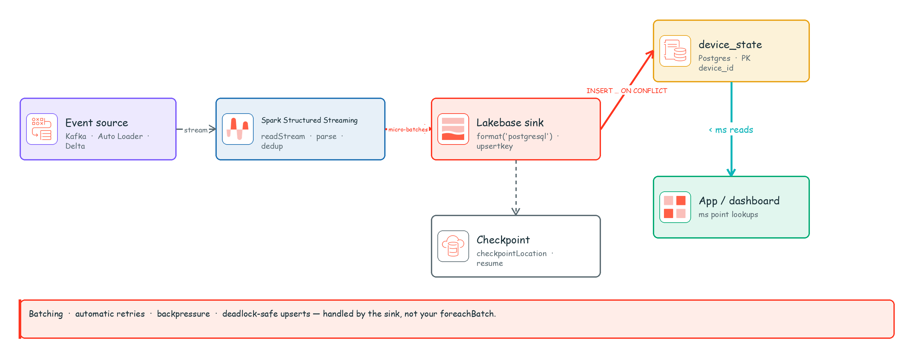

# Stream straight into Postgres: the Lakebase sink that finally retires `foreachBatch`

*A hands-on guide to firehosing low-latency streams into Lakebase — and finally retiring the most cursed closure in the codebase.*

---

Spend enough years around streaming pipelines and you start to recognize the same scar tissue on every team you walk into.

It shows up the moment a stream has to land in an operational database. Someone opens `foreachBatch`, cracks a JDBC connection inside the closure like it's 2014, hand-writes an upsert, bolts on retry logic for the deadlock everyone knows is coming, adopts a connection pool nobody wanted, and then burns an afternoon trying to prove the whole contraption is idempotent on replay. It usually isn't. They find out in production, at night, on a weekend. (It's always at night.)

I've watched a lot of good engineers write that exact code. I've sat next to them while we debugged it, sketched the same deadlock on a whiteboard for the third time, and gently explained — once again — why the replay duplicated half the rows. It's a rite of passage, and a miserable one. Nobody has ever finished it and said "that was fun."

So when Databricks Runtime 18 shipped a **first-class Lakebase sink** for Structured Streaming, a whole category of hard-won suffering quietly became obsolete. It writes straight to a Lakebase (managed Postgres) table — with batching, automatic retries, backpressure, and workspace-managed auth all baked in. A few `.option()` calls and you're done. No closure. No pool. No 11pm correctness crisis.

This post is the hands-on tour, built around a generic IoT/clickstream example: a stream of device events that continuously **upserts** a "latest state per device" table in Lakebase, which a live app or dashboard then reads with single-digit-millisecond point lookups. Fast in, fast out, zero boilerplate. Let's go.

---

## Why this one matters

The pattern is *everywhere*, and once you've seen it on enough teams you spot it instantly: events stream in, and something operational — an app, a dashboard, an API — needs the **current** state. Not a Delta snapshot from 15 minutes ago. Now. The number from this second.

The docs frame three canonical use cases, and honestly they're all the same dream wearing different hats:

- **Real-time updates to application databases** powering operational dashboards.
- **Continuous sync** of changing data into a transactional store.
- **Sub-second streaming output** to Postgres tables using real-time mode.

The old way to do all three was `foreachBatch` + JDBC. And to be fair, it *works*. So does pushing your car to the office. The catch is that the team owns every miserable part: connection lifecycle, batching, conflict handling, deadlock retries, and the philosophical burden of proving it correct. The Lakebase sink quietly takes all of that off the table and never brings it up again.

---

## First, the lay of the land: Lakehouse ↔ Lakebase

Before we dive in, a quick map — because the streaming sink isn't a lone tool, it's one of **four** ways data moves between the lakehouse (Delta / Unity Catalog) and Lakebase (managed Postgres). Knowing all four means you'll never reach for the wrong one. They split along two simple questions: **which way is the data flowing**, and **are you moving it or just querying it where it sits**.

**Writing *into* Lakebase** (lakehouse → Postgres, for serving):

- **Synced tables** — a managed, declarative copy of a Delta/UC table into Postgres. You pick a sync mode, Databricks runs the pipeline, you go get coffee.
- **Streaming sink** *(this post — the star of the show)* — you own a Structured Streaming query and write its output continuously into a Postgres table, with upserts.

**Reading *out of* Lakebase** (Postgres → lakehouse, for analytics/governance):

- **Change Data Feed (CDF)** — every insert/update/delete on a Postgres table gets captured from the write-ahead log and materialized as a Delta history table in Unity Catalog. Your Postgres grows a memory.
- **Unity Catalog registration** — register the Postgres database as a *read-only* catalog and query its live data with serverless SQL, right next to your lakehouse tables. No copy, no ETL, no excuses.


*The four bridges between the lakehouse and Lakebase. Rows 1–2 write into Lakebase for serving; rows 3–4 read back out for analytics and governance. The one glowing red is why you're here.*

| Integration | Direction | Use case | Typical latency |
|---|---|---|---|
| **Synced tables** | Lakehouse → Lakebase | Serve curated Delta/UC tables to apps as Postgres rows; pick snapshot / triggered / continuous per source churn | Continuous = near-real-time (**min ~15s** refresh); triggered / snapshot = on demand or scheduled |
| **Streaming sink** *(this post)* | Lakehouse → Lakebase | Continuously write a streaming query's output into a Postgres table (upsert or insert) | **Sub-second** with real-time mode |
| **Change Data Feed (CDF)** | Lakebase → Lakehouse | Capture Postgres inserts/updates/deletes into Delta history (`lb_<table>_history`) for bronze ETL, audit, external readers | **~15s** batched flush from the WAL |
| **UC registration** | Lakebase → Lakehouse *(query in place)* | Federated, read-only SQL over *live* Postgres data + unified governance/discovery in Catalog Explorer | **Live** query (UC caches metadata) |

The cheat sheet:

- Need lakehouse data **inside the app DB**? → **synced tables** if a managed copy on a cadence is plenty; the **streaming sink** if you've already got a stream and you want sub-second, upsert-shaped writes (and you do, you absolutely do).
- Need Postgres data **back in the lakehouse**? → **CDF** to *materialize* change history into Delta; **UC registration** to *query it live* without copying a single byte.

For the *write-into-Lakebase* direction specifically, the four options line up beautifully on a latency axis. And the rule is gloriously simple: **pick the cheapest one that meets the freshness your use case actually needs.** Freshness isn't free — don't pay sub-second money for a dashboard nobody refreshes before lunch.


*The streaming sink lives at the sub-second end. Synced tables stretch from near-real-time (continuous) through scheduled (triggered) to on-demand (snapshot). Pick your spot on the line; your wallet will thank you.*

The rest of this post is that glowing red box on the far left — the sub-second end of the axis. Buckle up.

---

## What you'll need

- **Databricks Runtime 18** or above.
- **Classic compute** with *dedicated* or *standard* access mode. (Serverless is **not** supported — yes, I know, we'll mourn it together in the limitations section.)
- A **Lakebase database** (Lakebase Autoscale / managed Postgres).

And that's the whole shopping list. No driver to install, no secrets to plumb, no `.jar` to mysteriously misplace — for Unity Catalog–registered tables, credentials are handled automatically using the executing user's or service principal's identity. It just *knows who you are*. Refreshing, isn't it?

Here's the pipeline we're about to build:


*A streaming source feeds Spark Structured Streaming, the Lakebase sink upserts micro-batches into a Postgres table via `INSERT … ON CONFLICT`, and an app reads current state with millisecond point lookups. Notice what's missing: a single line of connection-pool code.*

---

## Step 1 — Create the target table (give it a primary key, I beg you)

The sink will happily auto-create the table for you on the Unity Catalog path. But we want **upserts**, and upserts need a real `PRIMARY KEY` to fight over — the sink keys its `ON CONFLICT` clause off the table's primary-key constraint. So let's be grown-ups and create it explicitly in Lakebase first:

```sql
-- Run against your Lakebase database
CREATE TABLE iot.device_state (
  device_id    TEXT        PRIMARY KEY,
  temperature  DOUBLE PRECISION,
  humidity     DOUBLE PRECISION,
  status       TEXT,
  event_ts     TIMESTAMPTZ
);
```

Tattoo this somewhere: your **upsert key must reference columns that carry a `PRIMARY KEY` constraint** on the target table. Here that's `device_id`. No primary key, no upsert. That's the deal.

---

## Step 2 — Build the streaming source

Anything that produces a streaming DataFrame is fair game — Kafka, Auto Loader, Delta, your wildest event source. Here's a bog-standard Kafka read parsing JSON device events:

```python
from pyspark.sql.functions import col, from_json
from pyspark.sql.types import (
    StructType, StructField, StringType, DoubleType, TimestampType
)

schema = StructType([
    StructField("device_id",   StringType()),
    StructField("temperature", DoubleType()),
    StructField("humidity",    DoubleType()),
    StructField("status",      StringType()),
    StructField("event_ts",    TimestampType()),
])

events = (
    spark.readStream
        .format("kafka")
        .option("kafka.bootstrap.servers", "<broker>:9092")
        .option("subscribe", "device-events")
        .load()
        .select(from_json(col("value").cast("string"), schema).alias("e"))
        .select("e.*")
)
```

> **No Kafka cluster lying around?** No problem. Swap the source for `spark.readStream.format("rate")` and conjure `device_id`, `temperature`, and friends out of the `value` column. The sink code below doesn't change one character — which is kind of the whole point.

Now, a subtle thing that'll save you a headache: since we're tracking *latest state per device*, a single micro-batch can contain several events for the same `device_id`. The sink is unbothered — it sorts rows by the upsert key within each batch (which also stops it from deadlocking against itself, a class of self-own we can all do without). If you want strict "newest event wins" semantics, dedup within the batch first — keep the max `event_ts` per `device_id` and move on with your life.

---

## Step 3 — Write to Lakebase (the Unity Catalog way)

Okay. Deep breath. This is the entire sink. The thing that replaces all that misery. Behold `format("postgresql")` and the magnificent `upsertkey`:

```python
(events.writeStream
    .format("postgresql")
    .outputMode("update")
    .option("upsertkey", "device_id")
    .option("checkpointLocation", "/Volumes/main/iot/_chk/device_state")
    .toTable("main.iot.device_state"))
```

That's it. That's the post, really. With `upsertkey` set, the sink fires Postgres
`INSERT INTO ... ON CONFLICT (device_id) DO UPDATE SET ...` under the hood — new devices inserted, existing devices updated in place, all without you typing the words "ON CONFLICT" once. Drop the `upsertkey` option and it falls back to plain inserts. Your call.

A few house rules for the upsert key, learned so you don't have to:

- It must be a **non-empty subset of your DataFrame columns** (it can't upsert on a column you didn't bring).
- It must map to **primary-key columns** on the target table.
- It must be **comparable types** — numeric or string. Structs and other exotic types need not apply.
- Composite key? Comma-separate it: `.option("upsertkey", "tenant_id,device_id")`.
- Column names are auto-double-quoted, so reserved words and weird characters in column names Just Work™. (Yes, even that column your teammate named `order`.)

---

## Step 3b — The non–Unity Catalog variant

Not registered in Unity Catalog? Fine, we can do it the manual way too. Hand over the connection coordinates and call `.start()` instead of `.toTable()`:

```python
(events.writeStream
    .format("postgresql")
    .outputMode("update")
    .option("endpoint", "<project-id>.<branch-id>.<endpoint-id>")
    .option("database", "<database>")
    .option("dbtable", "iot.device_state")
    .option("upsertkey", "device_id")
    .option("checkpointLocation", "/Volumes/main/iot/_chk/device_state")
    .start())
```

Same behavior, same vibes. The UC path is the comfier ride — it manages credentials and creates the table if it's missing. The non-UC path hands you the keys and lets you point at the endpoint directly. Both get you to the same place; one just makes you check the map.

---

## Step 4 — Turn the dials (batching & throughput)

The sink buffers rows and flushes a batch as a single database transaction the moment **either** threshold trips:

| Option | Default | What it does |
|---|---|---|
| `batchsize` | `1000` | Max rows per database transaction |
| `batchinterval` | `100ms` | Max time a row waits in the buffer before a flush |
| `checkpointLocation` | *(required)* | Checkpoint directory |
| `upsertkey` | *none* | Comma-separated upsert key columns |

So out of the box: flush every 1,000 rows or every 100 ms, whichever blinks first. Sensible defaults — but you're an adult, turn the dials:

```python
(events.writeStream
    .format("postgresql")
    .outputMode("update")
    .option("upsertkey", "device_id")
    .option("batchsize", "5000")        # bigger transactions, higher throughput
    .option("batchinterval", "250ms")   # let the buffer fill a bit more
    .option("checkpointLocation", "/Volumes/main/iot/_chk/device_state")
    .toTable("main.iot.device_state"))
```

And here's my favorite part — the part that used to be a whole JIRA epic. When Lakebase can't keep up with the firehose, the sink **propagates backpressure upstream**: Spark eases off the read side instead of inflating buffers until something explodes. Flow control, for free, with zero code. I didn't write it. I didn't debug it. I just get to have it.

---

## Step 5 — Go full real-time

The sink supports the whole trigger lineup:

- `realTime` — continuous, sub-second latency (the good stuff)
- `ProcessingTime` — fixed micro-batch interval
- `AvailableNow` — drain everything available, then stop
- `Once` — a single batch and out

When you want the latency low enough to feel rude, go real-time:

```python
(events.writeStream
    .format("postgresql")
    .outputMode("update")
    .option("upsertkey", "device_id")
    .option("checkpointLocation", "/Volumes/main/iot/_chk/device_state")
    .trigger(realTime="5 seconds")
    .toTable("main.iot.device_state"))
```

On output modes: `update` and `append` both work — and `append` is secretly `update` in a trench coat (it upserts when a primary key exists, inserts otherwise). `complete` is **not** supported, and thank goodness, because rewriting your entire operational table on every micro-batch is a war crime, not a feature.

---

## The part where we stay honest: checkpoints, retries, idempotency

Two things keep this trustworthy in production:

1. **Checkpointing.** `checkpointLocation` isn't optional, and that's a gift. The stream remembers exactly where it was, so a restart resumes instead of reprocessing your entire history while you watch the bill climb.

2. **Automatic retries.** Transient JDBC failures — dropped connections, deadlocks, rate-limiting — get retried for you, quietly, instead of nuking the batch and paging you about it.

Now let me be scrupulously honest, because I respect you: the docs **don't** make an explicit end-to-end exactly-once promise, so neither will I. But here's the thing that makes it not matter much — **upserts keyed on a primary key are idempotent.** Replay the same batch after a hiccup and you converge to the exact same row state. That property plus checkpointing is *precisely* why the upsert path is the one you want for operational tables. The catch: go insert-only (no `upsertkey`) and you throw that idempotency away — a replay can happily duplicate rows. So don't do that unless duplicates are genuinely fine. Choose your sink, choose your destiny.

---

## The fine print (read it before you commit, not after)

- **Serverless compute is not supported** — Classic only (dedicated or standard access mode). Pour one out.
- **Lakeflow Spark Declarative Pipelines are not supported** — this is a Structured Streaming sink, full stop, not an SDP target.
- **Lakebase only.** The target has to be a Lakebase database. Your random external Postgres-compatible thing in a corner? Not invited.
- `complete` output mode is not supported (see: war crimes, above).

None of these are dealbreakers for the use case this thing was born for. But knowing them now beats discovering them in a code review later.

---

## So… when do I reach for it?

Whenever a stream needs to keep an **operational, queryable table** fresh at the lowest sane latency: live dashboards, "current state" tables behind an app, continuous CDC-ish sync into Postgres. The Lakebase sink takes the entire `foreachBatch` + JDBC + retry + connection-pool circus and folds it into a fistful of `.option()` calls — and it handles the thankless parts (batching, backpressure, deadlock-safe upserts, retries) better and more carefully than I ever bothered to by hand. And I *tried*. For years.

Here's my actual, unhedged take: if your sink is Lakebase and you're on DBR 18+, hand-rolling this plumbing in 2026 isn't engineering grit — it's just unpaid suffering. Delete the closure. Write the five options. Go reclaim your afternoon.

You earned it.

---

**References**

- [Use Lakebase as a sink for Structured Streaming](https://docs.databricks.com/aws/en/structured-streaming/lakebase)
- [Sync data from Unity Catalog to Lakebase (synced tables)](https://docs.databricks.com/aws/en/oltp/instances/sync-data/sync-table)
- [Lakebase Change Data Feed](https://docs.databricks.com/aws/en/oltp/projects/lakebase-cdf)
- [Register a Lakebase database in Unity Catalog](https://docs.databricks.com/aws/en/oltp/projects/register-uc)
